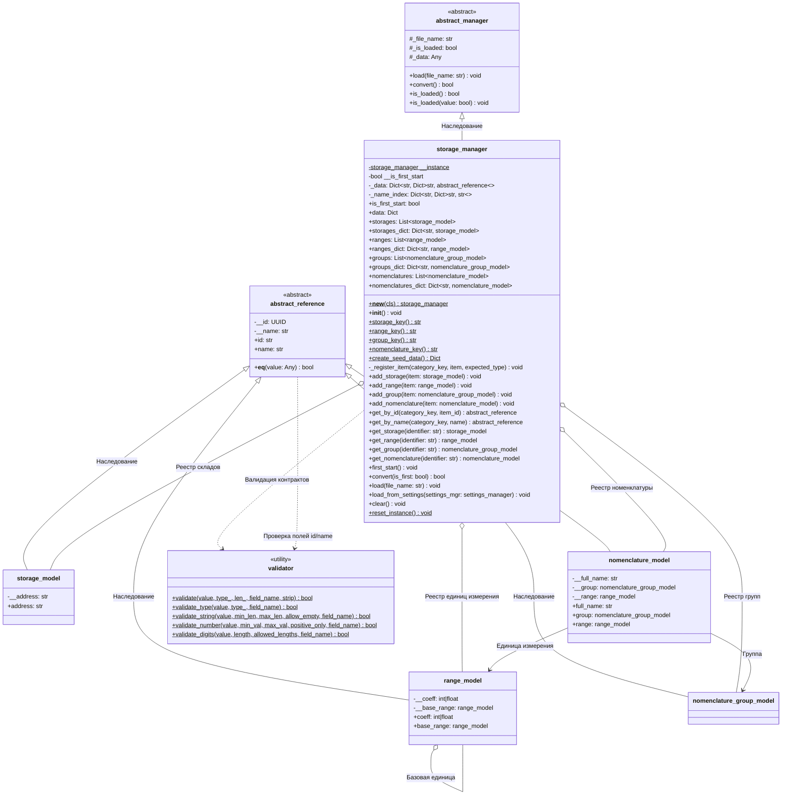
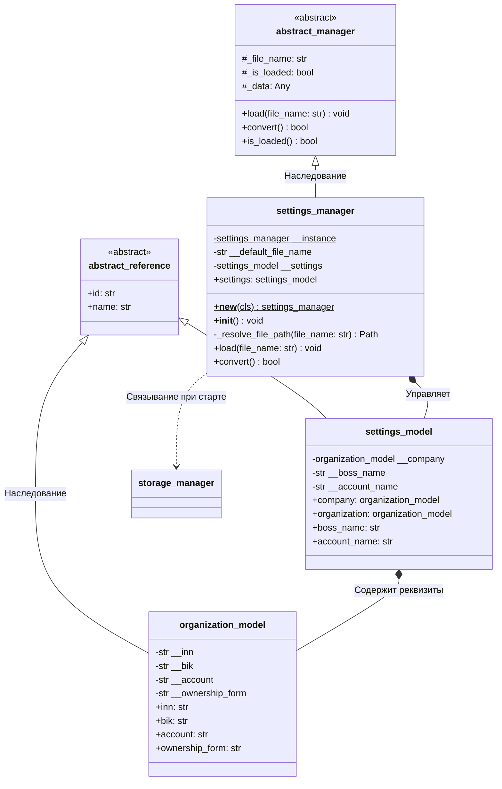
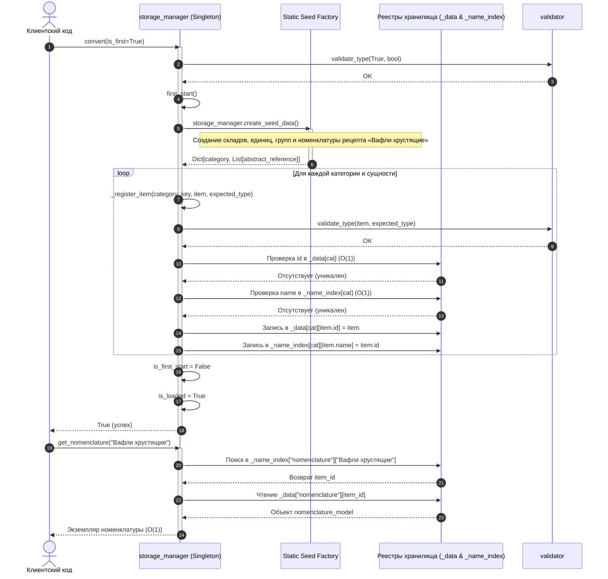

# Архитектурные UML-диаграммы классов: settings_manager и storage_manager

**Автор:** Alexander  
**Проект:** Информационная система ресторанной сети «Ромашка»  
**Паттерны проектирования:** Singleton, Registry, Static Factory Method, Centralized Validator  
**Кандидат:** Candidate 1 — Direct Registry Storage & Static Seed Factory  

---

## 1. Концептуальный обзор архитектуры

Подсистема управления конфигурацией и доменными данными ресторана построена на базе общей иерархии менеджеров `abstract_manager`.
Для обеспечения целостности данных, разделения глобального состояния и гарантии отсутствия дублирования в памяти применяются:
1. **Шаблон Singleton (Одиночка):** Классы `settings_manager` и `storage_manager` реализуют контролируемое создание единственного экземпляра через переопределение метода `__new__`.
2. **Шаблон Registry (Реестр):** Класс `storage_manager` служит центральным типизированным хранилищем доменных моделей (`storage_model`, `range_model`, `nomenclature_group_model`, `nomenclature_model`), поддерживая мгновенный доступ за время $O(1)$ по первичному суррогатному ключу `id` и бизнес-наименованию `name`.
3. **Шаблон Static Factory Method (Статическая фабрика данных):** Метод `storage_manager.create_seed_data()` инкапсулирует алгоритм конструирования нормализованного первичного графа объектов (рецептура венских вафель, склады и единицы измерения) без побочных эффектов.
4. **Централизованный валидатор контрактов:** Класс `validator` гарантирует строгое соблюдение инвариантов типов, ограничений по длине и защиту от классических ловушек Python (включая bool-as-int и IEEE 754 NaN/Inf).

---

## 2. Диаграмма классов storage_manager и доменных моделей

---

## 3. Диаграмма классов settings_manager и моделей настроек

---

## 4. Диаграмма последовательности: Инициализация первичных данных (First Start)

---

## 5. Описание ключевых связей и контрактов

1. **`storage_manager` и `abstract_manager`:** Наследование с перегрузкой виртуальных методов `load()` и `convert()`. Позволяет использовать полиморфную логику загрузчиков в соответствии с принципом подстановки Лисков (LSP).
2. **`storage_manager` и `storage_model` / `range_model` / `nomenclature_group_model` / `nomenclature_model`:** Отношение ассоциации и агрегации (коллекции объектов находятся в оперативной памяти менеджера, время жизни контролируется процессом приложения).
3. **Хранение в виде `Dict[str, Dict[str, abstract_reference]]`:** Каждая сущность сохраняется с ключом `id`, а вторичный словарь `_name_index` сохраняет проекцию `name -> id`. Это гарантирует отсутствие полных сканирований коллекций при выборках.
4. **Валидация уникальности:** При вызове методов добавления `add_*` проверяется как суррогатный ключ `id`, так и естественный бизнес-ключ `name`. При обнаружении дубликата выбрасывается `operation_exception`.
